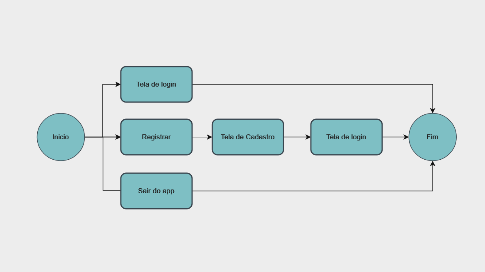
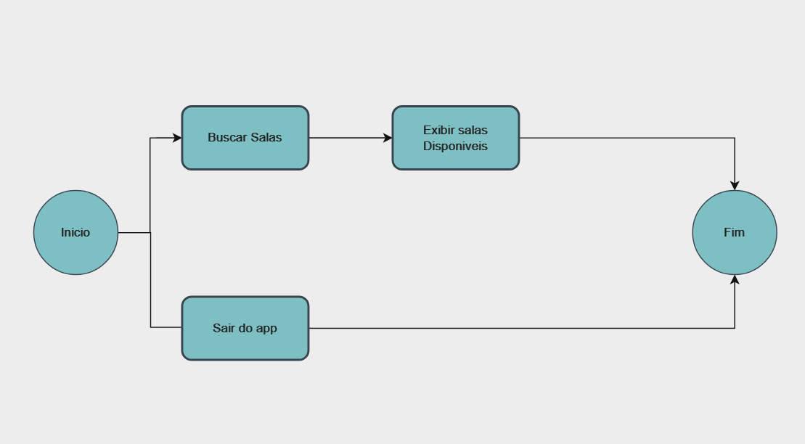
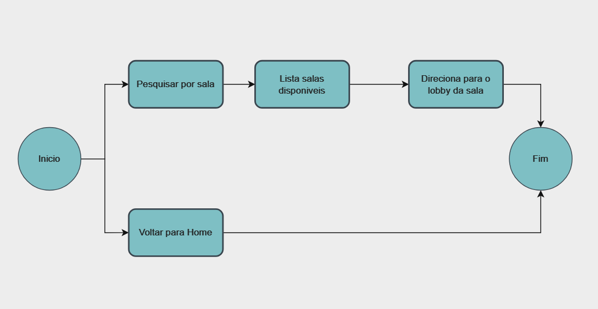
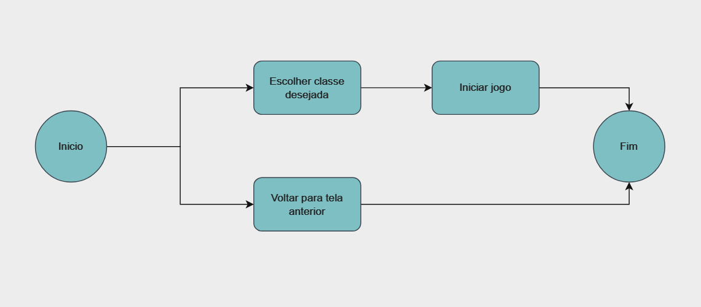
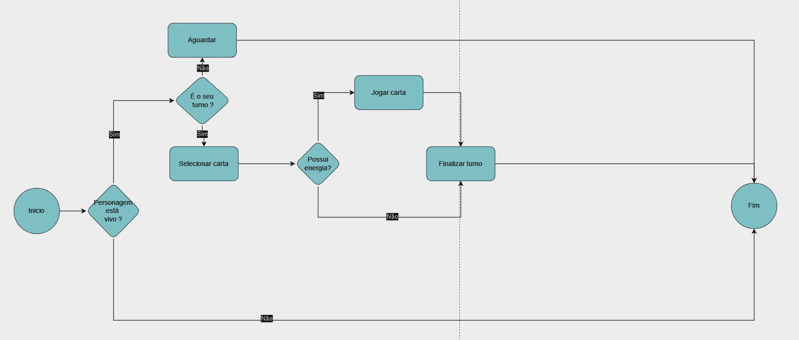

# Projeto de Interface

Pré-requisitos: <a href="2-Especificação do Projeto.md"> Documentação de Especificação</a>

Visão geral da interação do usuário pelas telas do sistema e protótipo interativo das telas com as funcionalidades que fazem parte do sistema (wireframes).

## Diagrama de Fluxo

O diagrama apresenta o estudo do fluxo de interação do usuário com o sistema interativo e  muitas vezes sem a necessidade do desenho do design das telas da interface. Isso permite que o design das interações seja bem planejado e gere impacto na qualidade no design do wireframe interativo que será desenvolvido logo em seguida.

O diagrama de fluxo pode ser desenvolvido com “boxes” que possuem internamente a indicação dos principais elementos de interface - tais como menus e acessos - e funcionalidades, tais como editar, pesquisar, filtrar, configurar - e a conexão entre esses boxes a partir do processo de interação.

### Diagrama de fluxo - Login

### Diagrama de fluxo - Cadastro

### Diagrama de fluxo - Cartas

### Diagrama de fluxo - Progresso

## Diagrama Mobile

### Diagrama de fluxo - Home

### Diagrama de fluxo - Home Logado

### Diagrama de fluxo - Buscar Sala

### Diagrama de fluxo - Lobby

### Diagrama de fluxo - Jogo

# Wireframes

### Tela de Login

Tela responsável pela Login do usuário. 

### Tela de Cadastro

Tela responsável pelo cadastro do Usuário. 

### Tela de Progresso

Tela responsável pela visualização das Conquistas do Usuário. Cada conquista exibe a descrição da conquista e informa a data e hora que a conquista foi obtida. 

### Tela de Cartas

Tela responsável pela visualização das Cartas que o usuário conquistou ate o momento. Cada carta exibe o icone e a descrição de suas abilidade.

## Telas Mobile

### Tela de Login

Tela responsável pela Login do usuário. 

### Tela de Home Deslogado

Tela responsável pela Home do usuário antes de estar logado. 

### Tela de Home Logado

Tela responsável pela por exibir o Home para o usuário logado. 

### Tela de Pesquisar Sala

Tela responsável pela busca das salas disponiveis para o usuário. 

### Tela de Lobby

Tela responsável pelo Lobby da sala selecionada pelo usuário. 

### Tela do Jogo

Telas responsável pelo Jogabilidae entre os usuários. 

São protótipos usados em design de interface para sugerir a estrutura de um site web e seu relacionamentos entre suas páginas. Um wireframe web é uma ilustração semelhante do layout de elementos fundamentais na interface.
 

