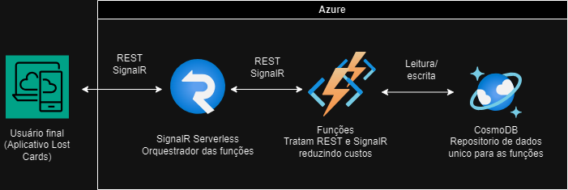
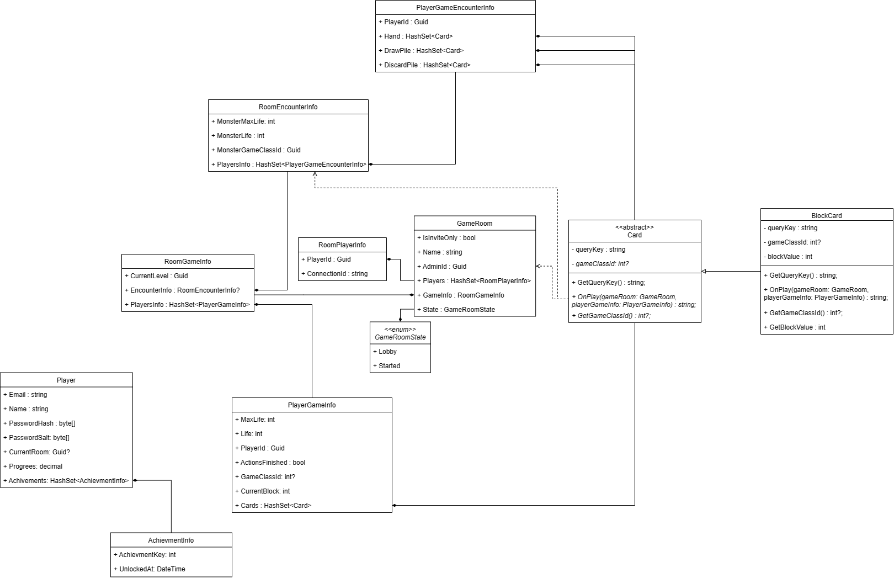
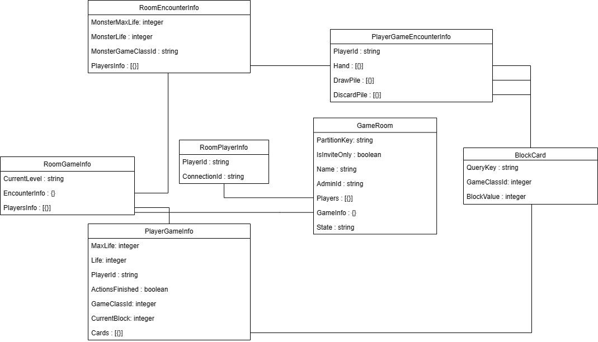
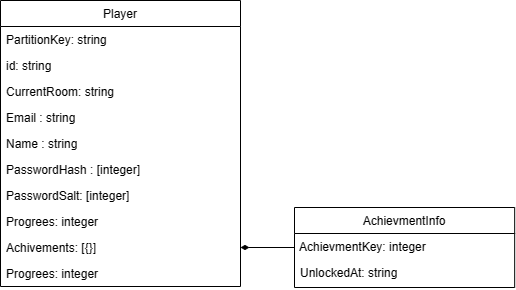

# Arquitetura da Solução



## Diagrama de Classes



## Modelo ER




## Esquema Relacional

### Documento da GameRoom

```json
{
  "$schema": "http://json-schema.org/draft-04/schema#",
  "type": "object",
  "properties": {
    "IsInviteOnly": {
      "type": "boolean"
    },
    "Name": {
      "type": "string"
    },
    "AdminId": {
      "type": "string"
    },
    "Players": {
      "type": "array",
      "items": [
        {
          "type": "object",
          "properties": {
            "PlayerId": {
              "type": "string"
            },
            "ConnectionId": {
              "type": "string"
            }
          },
          "required": [
            "PlayerId",
            "ConnectionId"
          ]
        }
      ]
    },
    "GameInfo": {
      "type": "object",
      "properties": {
        "CurrentLevel": {
          "type": "integer"
        },
        "EncounterInfo": {
          "type": "object",
          "properties": {
            "MonsterMaxLife": {
              "type": "integer"
            },
            "MonsterLife": {
              "type": "integer"
            },
            "MonsterGameClassId": {
              "type": "string"
            },
            "PlayersInfo": {
              "type": "array",
              "items": [
                {
                  "type": "object",
                  "properties": {
                    "PlayerId": {
                      "type": "string"
                    },
                    "Hand": {
                      "type": "array",
                      "items": [
                        {
                          "type": "object",
                          "properties": {
                            "QueryKey": {
                              "type": "string"
                            },
                            "GameClassId": {
                              "type": "integer"
                            },
                            "Id": {
                              "type": "integer"
                            }
                          },
                          "required": [
                            "QueryKey",
                            "GameClassId",
                            "Id"
                          ]
                        }
                      ]
                    },
                    "DrawPile": {
                      "type": "array",
                      "items": [
                        {
                          "type": "object",
                          "properties": {
                            "QueryKey": {
                              "type": "string"
                            },
                            "GameClassId": {
                              "type": "integer"
                            },
                            "Id": {
                              "type": "integer"
                            }
                          },
                          "required": [
                            "QueryKey",
                            "GameClassId",
                            "Id"
                          ]
                        }
                      ]
                    },
                    "DiscardPile": {
                      "type": "array",
                      "items": [
                        {
                          "type": "object",
                          "properties": {
                            "QueryKey": {
                              "type": "string"
                            },
                            "GameClassId": {
                              "type": "integer"
                            },
                            "Id": {
                              "type": "integer"
                            }
                          },
                          "required": [
                            "QueryKey",
                            "GameClassId",
                            "Id"
                          ]
                        }
                      ]
                    }
                  },
                  "required": [
                    "PlayerId",
                    "Hand",
                    "DrawPile",
                    "DiscardPile"
                  ]
                }
              ]
            }
          },
          "required": [
            "MonsterMaxLife",
            "MonsterLife",
            "MonsterGameClassId",
            "PlayersInfo"
          ]
        },
        "PlayersInfo": {
          "type": "array",
          "items": [
            {
              "type": "object",
              "properties": {
                "ActionsFinished": {
                  "type": "boolean"
                },
                "PlayerId": {
                  "type": "string"
                },
                "GameClassId": {
                  "type": "integer"
                },
                "MaxLife": {
                  "type": "integer"
                },
                "Life": {
                  "type": "integer"
                },
                "CurrentBlock": {
                  "type": "integer"
                },
                "Cards": {
                  "type": "array",
                  "items": [
                    {
                      "type": "object",
                      "properties": {
                        "QueryKey": {
                          "type": "string"
                        },
                        "GameClassId": {
                          "type": "integer"
                        },
                        "Id": {
                          "type": "integer"
                        }
                      },
                      "required": [
                        "QueryKey",
                        "GameClassId",
                        "Id"
                      ]
                    }
                  ]
                }
              },
              "required": [
                "ActionsFinished",
                "PlayerId",
                "GameClassId",
                "MaxLife",
                "Life",
                "CurrentBlock",
                "Cards"
              ]
            }
          ]
        }
      },
      "required": [
        "CurrentLevel",
        "EncounterInfo",
        "PlayersInfo"
      ]
    },
    "State": {
      "type": "integer"
    },
    "PartitionKey": {
      "type": "string"
    },
    "Id": {
      "type": "string"
    }
  },
  "required": [
    "IsInviteOnly",
    "Name",
    "AdminId",
    "Players",
    "GameInfo",
    "State",
    "PartitionKey",
    "Id"
  ]
}
```

### Documento do Player

```json
{
  "$schema": "http://json-schema.org/draft-04/schema#",
  "type": "object",
  "properties": {
    "Id": {
      "type": "string"
    },
    "CurrentRoom": {
      "type": "string"
    },
    "Discriminator": {
      "type": "string"
    },
    "Email": {
      "type": "string"
    },
    "Name": {
      "type": "string"
    },
    "PartitionKey": {
      "type": "string"
    },
    "PasswordHash": {
      "type": "array",
      "items": [
        {
          "type": "integer"
        }
      ]
    },
    "PasswordSalt": {
      "type": "array",
      "items": [
        {
          "type": "integer"
        }
      ]
    },
    "Progrees": {
      "type": "integer"
    },
    "Achivements": {
      "type": "array",
      "items": [
        {
          "type": "object",
          "properties": {
            "AchievmentKey": {
              "type": "integer"
            },
            "UnlockedAt": {
              "type": "string"
            }
          },
          "required": [
            "AchievmentKey",
            "UnlockedAt"
          ]
        }
      ]
    }
  },
  "required": [
    "Id",
    "CurrentRoom",
    "Discriminator",
    "Email",
    "Name",
    "PartitionKey",
    "PasswordHash",
    "PasswordSalt",
    "Progrees",
    "Achivements"
  ]
}
```

## Modelo Físico

Entregar um arquivo banco.sql contendo os scripts de criação das tabelas do banco de dados. Este arquivo deverá ser incluído dentro da pasta src\bd.

## Tecnologias Utilizadas

Descreva aqui qual(is) tecnologias você vai usar para resolver o seu problema, ou seja, implementar a sua solução. Liste todas as tecnologias envolvidas, linguagens a serem utilizadas, serviços web, frameworks, bibliotecas, IDEs de desenvolvimento, e ferramentas.

Apresente também uma figura explicando como as tecnologias estão relacionadas ou como uma interação do usuário com o sistema vai ser conduzida, por onde ela passa até retornar uma resposta ao usuário.

## Hospedagem

Utilizamos o Microsoft Azure como nosso provedor de hospedagem, que não apenas oferece uma infraestrutura escalável e confiável, mas também suporta uma arquitetura serverless. O Azure permite que implantemos, gerenciemos e dimensionemos nosso projeto de maneira eficaz e eficiente.

Optar por uma arquitetura serverless traz várias vantagens. Primeiramente, ela permite uma escalabilidade automática. Isso significa que o Azure gerencia a alocação de recursos para nossa aplicação com base na demanda, eliminando a necessidade de provisionar e gerenciar servidores.

Em segundo lugar, a arquitetura serverless segue o modelo de pagamento pelo uso, o que significa que só pagamos pelos recursos de computação que realmente usamos. Isso pode levar a uma redução significativa nos custos operacionais.

Além disso, a arquitetura serverless permite que nos concentremos mais no desenvolvimento do aplicativo, pois a manutenção e a administração do servidor são tratadas pelo Azure. Isso resulta em um tempo de colocação no mercado mais rápido.

A escolha do Azure como nosso provedor de hospedagem garante que nossa aplicação seja hospedada em um ambiente seguro e de alto desempenho. Além disso, a natureza serverless do Azure permite uma alta disponibilidade e tolerância a falhas, proporcionando uma experiência estável e confiável aos nossos usuários.

## Qualidade de Software

Conceituar qualidade de fato é uma tarefa complexa, mas ela pode ser vista como um método gerencial que através de procedimentos disseminados por toda a organização, busca garantir um produto final que satisfaça às expectativas dos stakeholders.

No contexto de desenvolvimento de software, qualidade pode ser entendida como um conjunto de características a serem satisfeitas, de modo que o produto de software atenda às necessidades de seus usuários. Entretanto, tal nível de satisfação nem sempre é alcançado de forma espontânea, devendo ser continuamente construído. Assim, a qualidade do produto depende fortemente do seu respectivo processo de desenvolvimento.

A norma internacional ISO/IEC 25010, que é uma atualização da ISO/IEC 9126, define oito características e 30 subcaracterísticas de qualidade para produtos de software.
Com base nessas características e nas respectivas sub-características, identifique as sub-características que sua equipe utilizará como base para nortear o desenvolvimento do projeto de software considerando-se alguns aspectos simples de qualidade. Justifique as subcaracterísticas escolhidas pelo time e elenque as métricas que permitirão a equipe avaliar os objetos de interesse.

> **Links Úteis**:
>
> - [ISO/IEC 25010:2011 - Systems and software engineering — Systems and software Quality Requirements and Evaluation (SQuaRE) — System and software quality models](https://www.iso.org/standard/35733.html/)
> - [Análise sobre a ISO 9126 – NBR 13596](https://www.tiespecialistas.com.br/analise-sobre-iso-9126-nbr-13596/)
> - [Qualidade de Software - Engenharia de Software 29](https://www.devmedia.com.br/qualidade-de-software-engenharia-de-software-29/18209/)

## Justificativa da utilização de um banco de dados Nosql

Eles oferecem escalabilidade horizontal eficiente, flexibilidade de esquema, alta disponibilidade e tolerância a falhas. Além disso, são otimizados para alto desempenho, oferecem modelos de dados específicos e integram-se bem com tecnologias modernas, tudo isso com custos de manutenção geralmente mais baixos do que os bancos de dados relacionais. Essas características os tornam essenciais para suportar a crescente demanda de armazenamento e acesso a dados em ambientes distribuídos, garantindo uma experiência de usuário responsiva e eficiente. 
