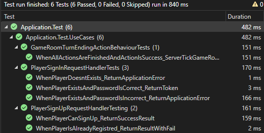
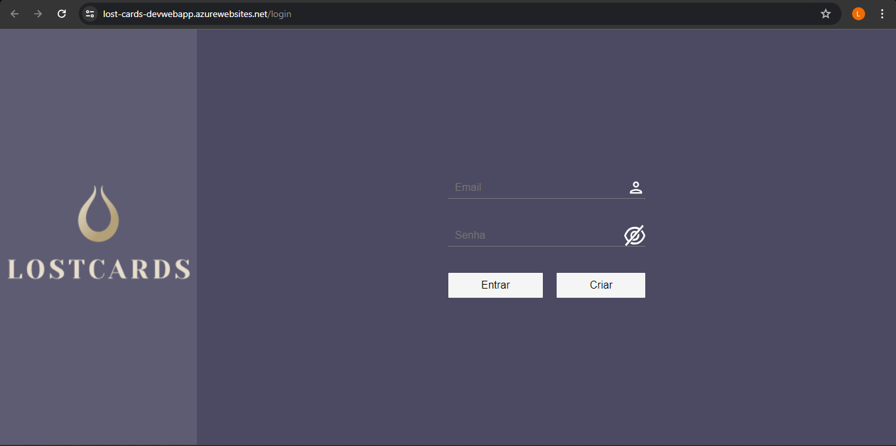
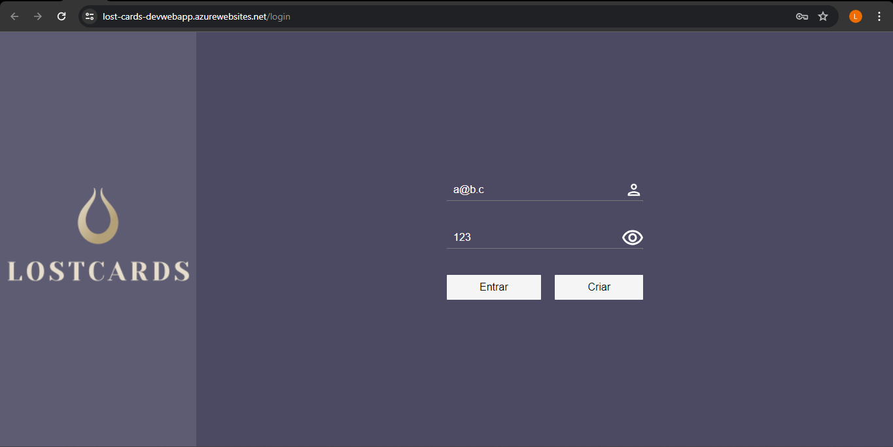
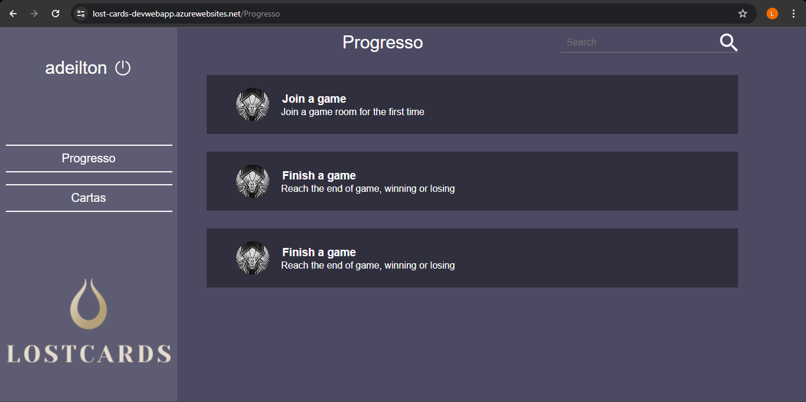

# Registro de Testes de Software

## Testes unitarios, 05/05/2024

## Cobertura e resultado por cenarios de testes
### Registro do Usuário
#### CT001 - Registro do Usuário ✅ (coberto por testes unitarios)
#### CT002 - Registro com Usuário existente ✅ (coberto por testes unitarios)
### Login de Usuário
#### CT003 - SignIn do Usuário ✅ (coberto por testes unitarios)
#### CT004 - SignIn do Usuário com senha errada ✅ (coberto por testes unitarios)
#### CT005 - SignIn do Usuário inexistente ✅ (coberto por testes unitarios)
### Ver Perfil
#### CT006 - Ver o propio perfil✅

## Avaliação

Discorra sobre os resultados do teste. Ressaltando pontos fortes e fracos identificados na solução. Comente como o grupo pretende atacar esses pontos nas próximas iterações. Apresente as falhas detectadas e as melhorias geradas a partir dos resultados obtidos nos testes.

> **Links Úteis**:
> - [Ferramentas de Test para Java Script](https://geekflare.com/javascript-unit-testing/)